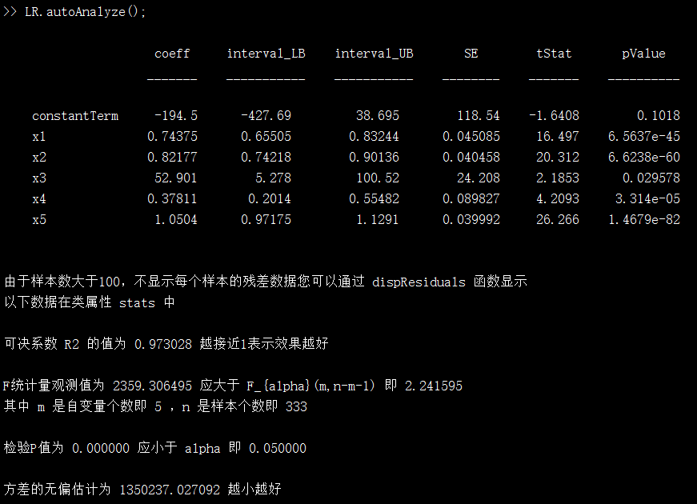
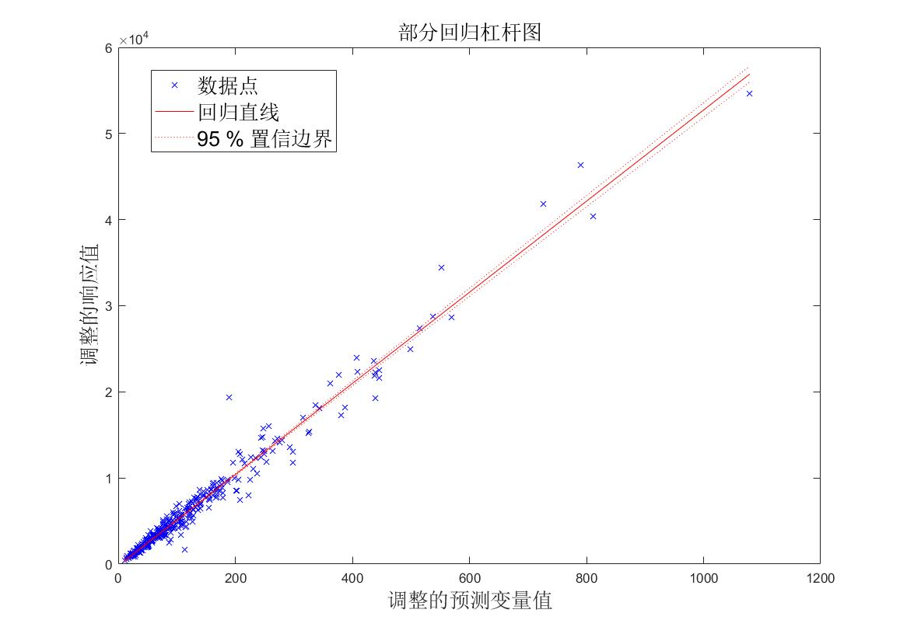
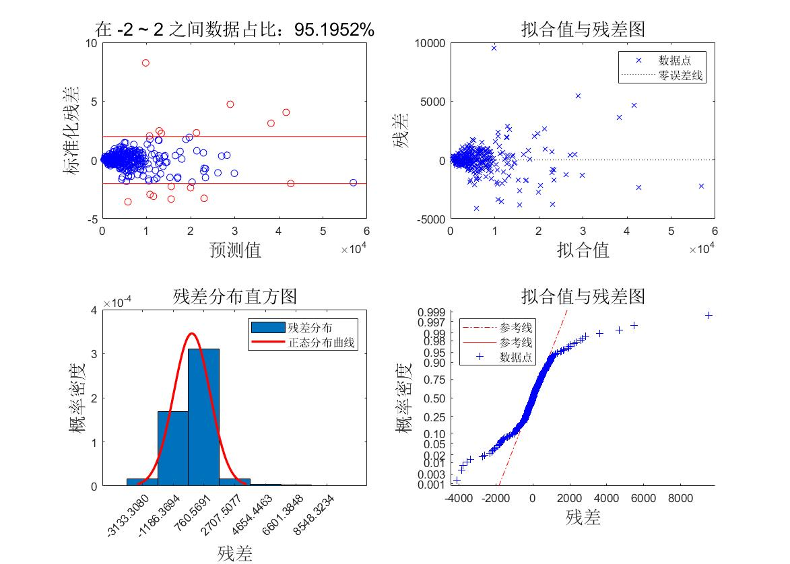
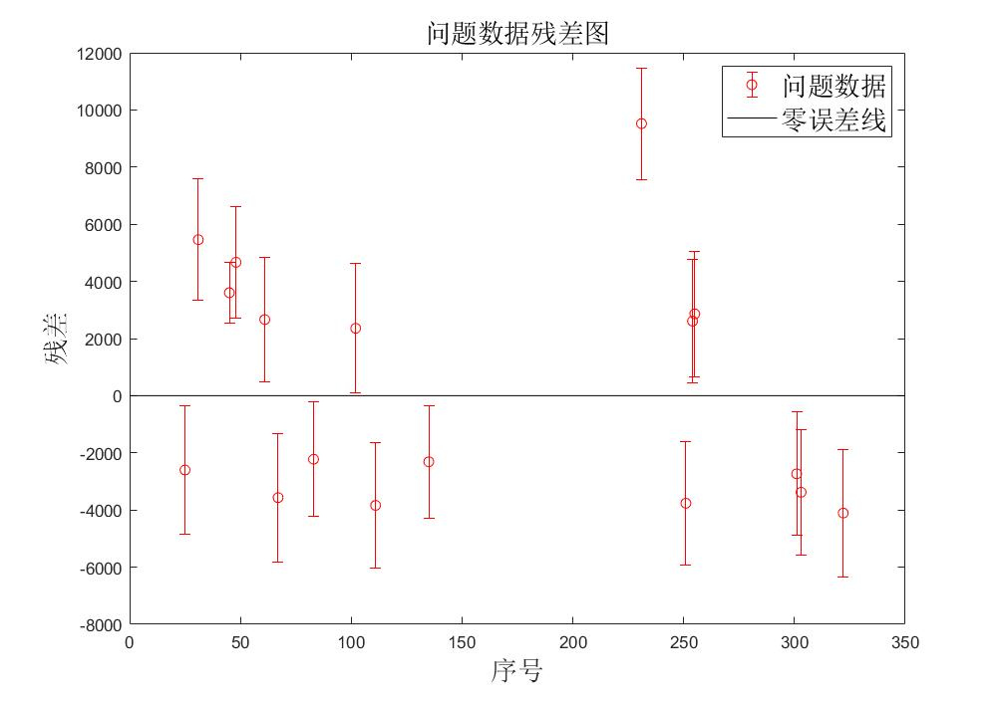
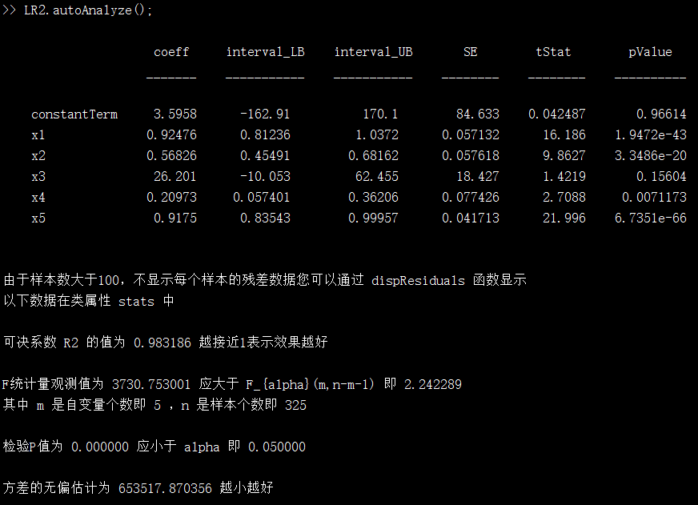
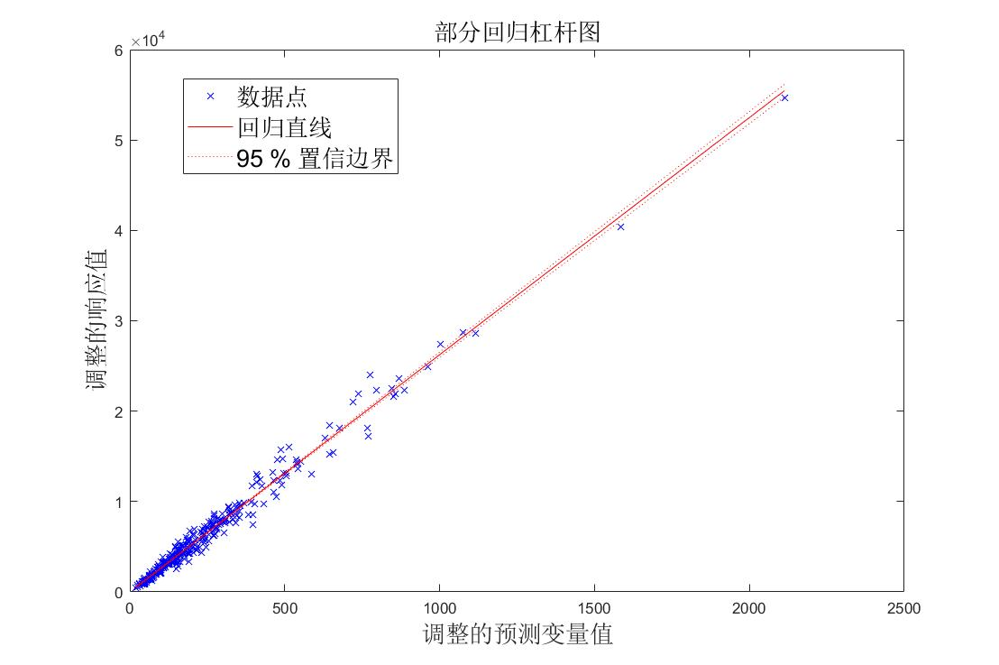
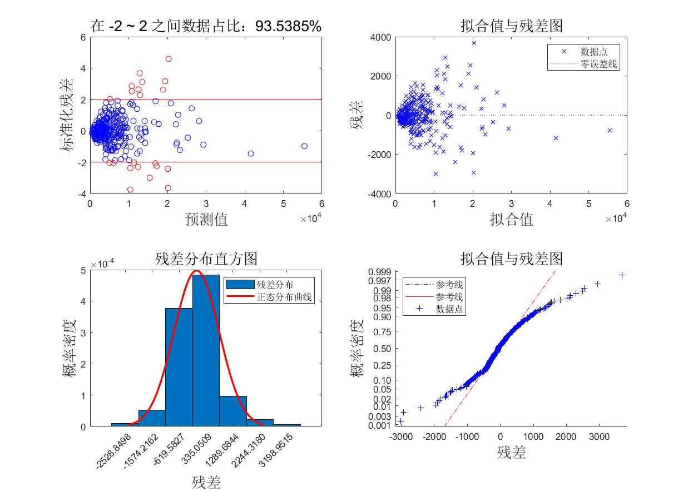
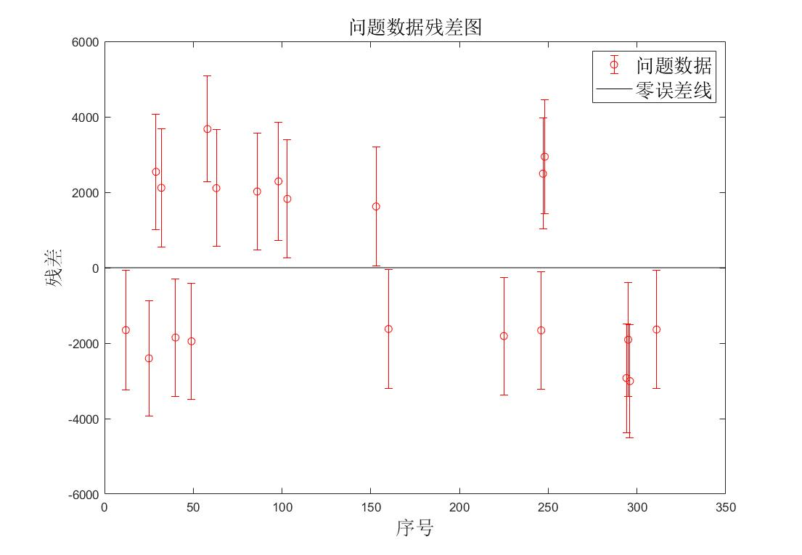

<center>
    <h1>
        线性回归类——LinearRegression
    </h1>
</center>

## 类说明

- 本类是线性回归类，可以进行多元线性回归预测。
- 本类可以作回归图、残差分析图、自变量与预测值图。
- 本类可以方便存储回归系数、残差等数据为 Excel 格式数据。

## 类属性

|              名称               |              说明              |
| :-----------------------------: | :----------------------------: |
|       forecastData(只读)        |    ForecastData类，预测数据    |
|       linearModel(非独立)       |    MATLAB自带LinearModel类     |
|   residualsCaseorder(非独立)    | ResidualsCaseorder类，用于作图 |
|     regressionCoeff(非独立)     |            回归系数            |
| regressionCoeffInterval(非独立) |        回归系数置信区间        |
|        residuals(非独立)        |              残差              |
|    residualsInterval(非独立)    |          残差置信区间          |
|          stats(非独立)          |   regress函数得出的评价数组    |
|       predictData(非独立)       |            预测数据            |
|    problemDataIndex(非独立)     |          问题数据序号          |
|              alpha              |            置信系数            |

#### 注：因变量根据正态分布在 $\mu\pm3\sigma$ 之外视为问题数据

## 类方法

#### 构造函数：obj = LinearRegression(X,Y)

X 为自变量数组，每一行为一个样本，每一列为一个属性。Y 为因变量，列向量。

#### 功能函数

##### [Yp,YpInterval] = predict(obj,XNew)

预测因变量，Xnew 为预测的自变量。Yp 为得出的因变量值，YpInterval 为得出的因变量置信区间。

##### objNew = screenData(obj)

筛除问题数据，返回一个 LinearRegression 类。

##### val = getCoeff(obj,string)

返回回归系数，string 可以为 cell、table、mat，分别指定返回元胞数组、表、数组。若省略则返回数组。

##### val = getResiduals(obj,string)

返回残差，string 可以为 cell、table、mat，分别指定返回元胞数组、表、数组。若省略则返回数组。

##### h = autoAnalyze(obj)

自动分析，并输出分析结果、作图。可返回一个 h ，其中包含了所有图像的句柄。

#### 作图函数

以下函数中，h 为返回图像的句柄，ax 为指定坐标区，可省略。

##### h = plotResiduals(obj,type,ax)

作残差分析图。type 为残差图的种类，如下表所示：

|    名称     |       说明       |
| :---------: | :--------------: |
|  caseorder  |    残差序列图    |
|   fitted    |  残差与拟合值图  |
|  histogram  |  残差分布直方图  |
|   lagged    | 残差与滞后残差图 |
| probability |  残差正态分布图  |
|  symmetry   |    残差对称图    |
|   pearson   |   标准化残差图   |
|   classic   |   作经典组合图   |

##### ==注：classic 不支持输入 ax 参数==

如果同时省略 type 和 ax 则作经典组合图和残差序列图。

##### h = plotRegressionEffect(obj,ax)

作回归效果图。

##### h = plotXY(obj,index,ax)

作自变量与预测值线性回归图，index 为 自变量在 X 中列序号。

若同时省略 index 和 ax 则作所有自变量与预测值的线性回归图。

##### h = plotFigure(obj)

作回归效果图和残差分析图。

#### 显示函数

##### dispCoeff(obj)

在命令行显示回归系数。

##### dispResiduals(obj)

在命令行显示残差。

##### dispFeasibility(obj)

根据类属性 stats 在命令行显示模型的可靠性。

##### dispResult(obj)

在命令行显示上述三个结果。

#### 存储函数

以下函数中，fileName 为存储的 Excel 表格名称，Excel 表格将存储在当前运行目录下。

##### writeCoeff(obj,fileName)

存储回归系数。

##### writeResiduals(obj,fileName)

存储残差。

##### writeResult(obj,fileName)

存储回归系数和方差。

## 实例

导入 LinearRegression 数据，其中 X_little、Y_little 是一组样本比较小的数据，X_large、Y_large 是一组样本比较大的数据。然后创建类，自动分析。

```matlab
load linearRegression
LR = LinearRegression(X_large,Y_large);
LR.autoAnalyze();
```

可在命令行得到结果：



可得到图形如下：







由图可知有数据分布在 $\mu \pm3\sigma$ 之外，将其视为问题数据，去除后重新分析。

```matlab
LR2 = LR.screenData();
LR2.autoAnalyze();
```









将回归系数和残差保存到 Excel 表格，命名为 example

```matlab
LR2.writeResult('example');
```

